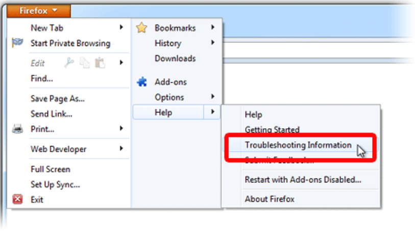
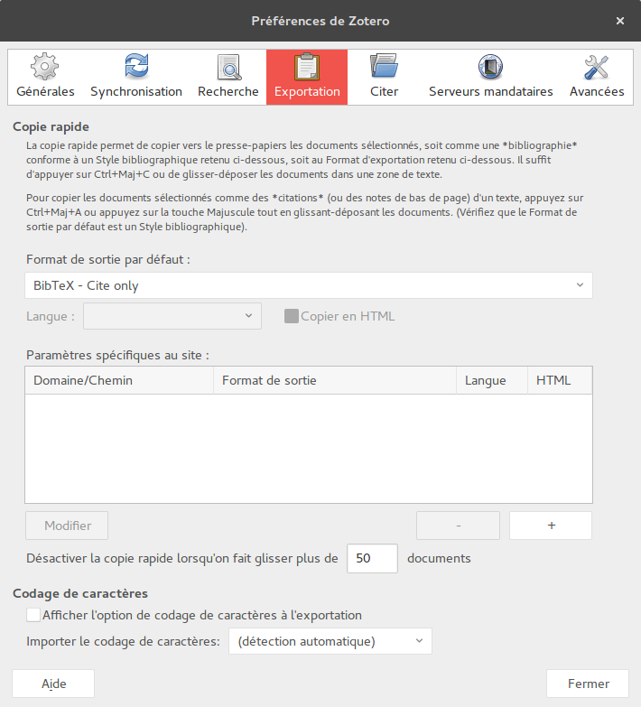

# Zotero citations for LaTeX / BibTeX translator

Author: Jan Krause
Publication date: 2017-06-02
License: [AGPLv3](https://www.gnu.org/licenses/agpl-3.0.en.html)
Source: This translator in a modification of the BibTeX translator written by Simon Kornblith and Richard Karnesky and distributed with [Zotero](http://zotero.org).

## About

Zotero allows to export one or more selected references by drag and drop. This translator uses this mechanism to generate the appropriated LaTeX `\cite{}` command and paste in any editor via drag and drop.

## Installation

Simply copy the translator file `BibTeXcite.js`in you Zotero translator folder and restart Firefox. 

You may locate the translator folder on you system in Firefox via the "Troobleshooting Information":

Open the "Help" menu (on some platforms you have to press `<Alt>` to make it appear), then select "Troobleshooting Information". Within the troubleshooting page click on the "Open" button near "Profile Directory", then browse to the folder Zotero / tranlators . Here you are.

## Usage

In Zotero preferences "Export" section, select the `BibTeX - Cite only` in the drop down list of formats (if it does not appear there, try restarting Firefox). Illustration:

That's it. You can now generate LaTeX `\cite{}` commands via drag-and-drop to your favourite editor.

Note: The generated citations keys correspond to the BibTeX entries exported using the BibTeX delfaut translator.

